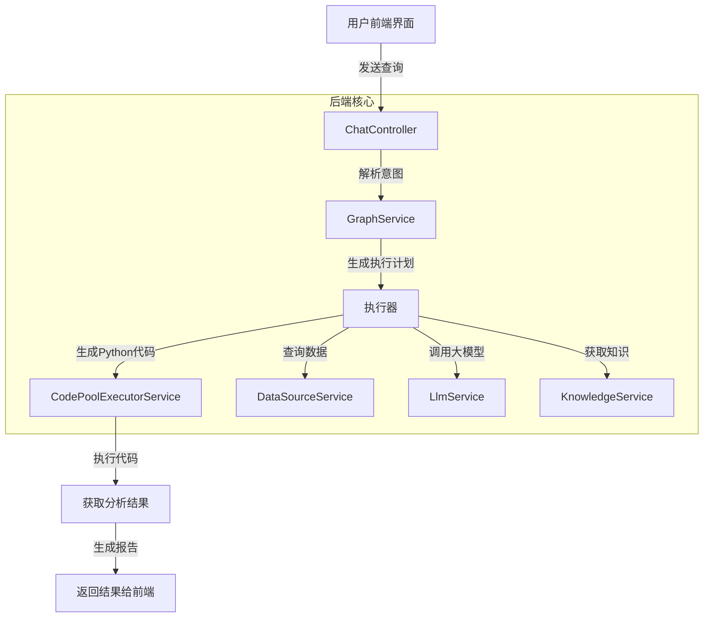

# DataAgent 项目 - 产品需求文档

## 1. 仓库概览

DataAgent 是一个基于大模型的数据分析智能代理系统，能够理解用户的自然语言查询，自动生成并执行数据分析任务，最终以结构化报告的形式呈现结果。

- **主要功能**：自然语言查询理解、数据分析任务规划、Python 代码生成与执行、结果可视化与报告生成
- **典型应用场景**：业务数据分析、报表生成、数据洞察发现、辅助决策支持
- **技术特点**：结合大语言模型的推理能力与 Python 的数据分析能力，实现智能化的数据分析流程

## 2. 目录结构

DataAgent 项目采用清晰的分层架构，前端与后端分离，核心业务逻辑集中在 data-agent-management 模块。项目结构设计遵循模块化原则，便于维护和扩展。

```text
├── data-agent-frontend/     # 前端界面代码
│   ├── src/                 # 前端源代码
│   │   ├── components/      # 组件库
│   │   ├── services/        # API 服务
│   │   └── views/           # 页面视图
│   └── package.json         # 前端依赖配置
├── data-agent-management/    # 后端核心业务逻辑
│   ├── src/main/java/       # Java 源代码
│   │   └── com/alibaba/cloud/ai/dataagent/  # 主包路径
│   ├── src/main/resources/  # 资源文件
│   │   ├── prompts/         # 大模型提示词模板
│   │   └── sql/             # 数据库脚本
│   └── pom.xml              # Maven 依赖配置
├── docker-file/             # Docker 部署配置
└── docs/                    # 项目文档
```

**核心模块职责表**：

| 模块 | 主要职责 | 文件位置 | 说明 |
| ---- | ------- | -------- | ---- |
| 代码执行服务 | 执行 Python 数据分析代码 | [code/](file:///Users/qiweideng/Desktop/DataAnalyseModel/代码库/SQLBot-main/DataAgent-main/data-agent-management/src/main/java/com/alibaba/cloud/ai/dataagent/service/code) | 支持本地、Docker 等多种执行方式 |
| 数据源管理 | 管理数据库连接和元数据 | [datasource/](file:///Users/qiweideng/Desktop/DataAnalyseModel/代码库/SQLBot-main/DataAgent-main/data-agent-management/src/main/java/com/alibaba/cloud/ai/dataagent/service/datasource) | 支持多种数据库类型 |
| 大模型服务 | 管理与大模型的交互 | [llm/](file:///Users/qiweideng/Desktop/DataAnalyseModel/代码库/SQLBot-main/DataAgent-main/data-agent-management/src/main/java/com/alibaba/cloud/ai/dataagent/service/llm) | 支持流式和阻塞式调用 |
| 知识库管理 | 管理业务知识和代理知识 | [knowledge/](file:///Users/qiweideng/Desktop/DataAnalyseModel/代码库/SQLBot-main/DataAgent-main/data-agent-management/src/main/java/com/alibaba/cloud/ai/dataagent/service/knowledge) | 支持文本分割和向量化 |
| 图服务 | 管理多轮对话和执行流程 | [graph/](file:///Users/qiweideng/Desktop/DataAnalyseModel/代码库/SQLBot-main/DataAgent-main/data-agent-management/src/main/java/com/alibaba/cloud/ai/dataagent/service/graph) | 实现复杂的任务执行逻辑 |

## 3. 系统架构与主流程

DataAgent 采用分层架构设计，从用户交互到数据处理形成完整的链路。系统通过前端界面接收用户查询，经过后端处理后生成分析结果和报告。

### 系统架构图



### 主要流程说明

1. **用户查询处理**：用户通过前端界面输入自然语言查询，系统接收后进行意图识别。
2. **执行计划生成**：根据用户意图和数据情况，生成详细的执行计划，包括数据获取、分析方法等。
3. **Python 代码执行**：系统自动生成 Python 代码并在安全的环境中执行，进行数据统计和分析。
4. **结果处理与报告生成**：分析结果经过处理后，生成结构化的报告并返回给用户。
5. **多轮对话管理**：系统支持多轮对话，能够根据上下文理解用户的后续查询。

## 4. 核心功能模块

### 4.1 代码执行服务

**功能说明**：负责安全地执行 Python 代码，是数据分析的核心执行引擎。

**实现原理**：
- 提供多种执行环境选项（本地执行、Docker 容器执行、AI 模拟执行）
- 支持代码执行结果的捕获和处理
- 确保执行环境的隔离和安全性

**核心类**：
- `CodePoolExecutorService`：代码执行服务接口
- `LocalCodePoolExecutorService`：本地执行实现
- `DockerCodePoolExecutorService`：Docker 容器执行实现
- `AiSimulationCodeExecutorService`：AI 模拟执行实现

**使用示例**：
```java
// 创建代码执行请求
CodePoolExecutorService.TaskRequest request = new CodePoolExecutorService.TaskRequest(
    pythonCode,  // Python 代码
    inputData,   // 输入数据
    requirement  // 执行要求
);

// 执行代码并获取结果
CodePoolExecutorService.TaskResponse response = codePoolExecutorService.runTask(request);

// 处理执行结果
if (response.isSuccess()) {
    String result = response.stdOut();
    // 处理成功结果
} else {
    String error = response.exceptionMsg();
    // 处理错误
}
```

### 4.2 大模型服务

**功能说明**：管理与大语言模型的交互，用于意图识别、代码生成、报告撰写等任务。

**实现原理**：
- 支持多种大模型接入
- 提供流式和阻塞式调用方式
- 管理模型配置和参数

**核心类**：
- `LlmService`：大模型服务接口
- `StreamLlmService`：流式调用实现
- `BlockLlmService`：阻塞式调用实现
- `LlmServiceFactory`：大模型服务工厂

### 4.3 数据源管理

**功能说明**：管理数据库连接和元数据，为数据分析提供数据来源。

**实现原理**：
- 支持多种数据库类型（MySQL、PostgreSQL、Oracle 等）
- 提供统一的数据源访问接口
- 管理数据库连接池和资源

**核心类**：
- `DatasourceService`：数据源服务接口
- `AgentDatasourceService`：代理数据源服务
- `Accessor`：数据访问接口
- `DBConnectionPool`：数据库连接池

### 4.4 知识库管理

**功能说明**：管理业务知识和代理知识，为大模型提供上下文信息。

**实现原理**：
- 支持文本分割和向量化
- 提供知识检索和融合功能
- 管理知识资源的生命周期

**核心类**：
- `AgentKnowledgeService`：代理知识服务
- `BusinessKnowledgeService`：业务知识服务
- `HybridRetrievalStrategy`：混合检索策略

## 5. 核心 API/类/函数

### 5.1 代码执行服务 API

**`CodePoolExecutorService.runTask(TaskRequest)`**
- **功能**：执行 Python 代码并返回执行结果
- **参数**：
  - `code`：要执行的 Python 代码
  - `input`：输入数据
  - `requirement`：执行要求
- **返回值**：`TaskResponse` 对象，包含执行状态和结果
- **使用场景**：用于执行数据分析、统计计算等任务

**`CodePoolExecutorServiceFactory.getService(CodePoolExecutorEnum)`**
- **功能**：获取指定类型的代码执行服务
- **参数**：`CodePoolExecutorEnum` 枚举值，指定执行方式
- **返回值**：`CodePoolExecutorService` 实现实例
- **使用场景**：根据配置选择合适的代码执行环境

### 5.2 大模型服务 API

**`LlmService.generate(String, Map<String, Object>)`**
- **功能**：调用大模型生成内容
- **参数**：
  - 提示词模板
  - 模板参数
- **返回值**：生成的内容
- **使用场景**：用于意图识别、代码生成、报告撰写等

**`LlmService.streamGenerate(String, Map<String, Object>)`**
- **功能**：流式调用大模型生成内容
- **参数**：
  - 提示词模板
  - 模板参数
- **返回值**：流式响应
- **使用场景**：用于需要实时反馈的场景

### 5.3 数据源服务 API

**`DatasourceService.getDatasourceById(Long)`**
- **功能**：根据 ID 获取数据源信息
- **参数**：数据源 ID
- **返回值**：数据源对象
- **使用场景**：获取数据源配置信息

**`Accessor.executeQuery(String, List<Object>)`**
- **功能**：执行 SQL 查询
- **参数**：
  - SQL 语句
  - 查询参数
- **返回值**：查询结果
- **使用场景**：从数据库获取数据

### 5.4 图服务 API

**`GraphService.execute(String, Long, Map<String, Object>)`**
- **功能**：执行分析任务
- **参数**：
  - 用户查询
  - 会话 ID
  - 上下文参数
- **返回值**：执行结果
- **使用场景**：处理用户的数据分析请求

## 6. 技术栈与依赖

| 技术/依赖 | 用途 | 版本 | 来源 |
| -------- | ---- | ---- | ---- |
| Java | 后端开发语言 | 17+ | [pom.xml](file:///Users/qiweideng/Desktop/DataAnalyseModel/代码库/SQLBot-main/DataAgent-main/data-agent-management/pom.xml) |
| Spring Boot | 后端框架 | 3.2.0+ | [pom.xml](file:///Users/qiweideng/Desktop/DataAnalyseModel/代码库/SQLBot-main/DataAgent-main/data-agent-management/pom.xml) |
| Python | 数据分析语言 | 3.8+ | 系统依赖 |
| Vue.js | 前端框架 | 3.0+ | [package.json](file:///Users/qiweideng/Desktop/DataAnalyseModel/代码库/SQLBot-main/DataAgent-main/data-agent-frontend/package.json) |
| Docker | 容器化执行环境 | 20.10+ | 系统依赖 |
| 大语言模型 | 智能分析和代码生成 | - | 外部服务 |
| JDBC | 数据库连接 | - | [pom.xml](file:///Users/qiweideng/Desktop/DataAnalyseModel/代码库/SQLBot-main/DataAgent-main/data-agent-management/pom.xml) |

## 7. 关键模块与典型用例

### 7.1 Python 数据分析模块

**功能说明**：通过 Python 代码执行实现深度数据分析，支持统计分析、数据可视化等功能。

**配置与依赖**：
- 需要 Python 环境（3.8+）
- 推荐安装数据分析库：pandas、numpy、matplotlib、seaborn 等

**使用示例**：

```python
# 示例：统计分析代码
import pandas as pd
import json

# 读取输入数据
data = json.loads('${input}')
df = pd.DataFrame(data)

# 执行统计分析
result = {
    'total_rows': len(df),
    'summary': df.describe().to_dict(),
    'correlation': df.corr().to_dict()
}

# 输出结果
print(json.dumps(result, ensure_ascii=False))
```

**常见问题与解决方案**：
- **问题**：Python 环境缺少必要的库
  **解决方案**：在执行环境中安装所需的依赖包
- **问题**：代码执行超时
  **解决方案**：优化代码或增加执行超时时间
- **问题**：内存不足
  **解决方案**：处理大数据集时使用分批处理

### 7.2 报告生成模块

**功能说明**：将分析结果转化为结构化的报告，支持文本和可视化展示。

**配置与依赖**：
- 依赖大语言模型进行报告撰写
- 前端支持 Markdown 和 ECharts 可视化

**使用示例**：

```java
// 生成报告
String userQuery = "分析销售数据趋势";
String pythonOutput = "{\"trend\": \"上升\", \"growth_rate\": 0.15}";

// 调用大模型生成报告
Map<String, Object> params = new HashMap<>();
params.put("user_query", userQuery);
params.put("python_output", pythonOutput);

String report = llmService.generate("python-analyze", params);
```

## 8. 配置、部署与开发

### 8.1 配置管理

**核心配置文件**：
- `application.yml`：主配置文件
- `application-h2.yml`：H2 数据库配置
- `CodeExecutorProperties`：代码执行服务配置

**主要配置项**：
- 大模型配置（API 密钥、模型名称等）
- 代码执行环境配置
- 数据源连接配置
- 知识库配置

### 8.2 部署方式

**Docker 部署**：
- 使用项目提供的 Dockerfile 和 docker-compose.yml
- 支持一键部署整个系统

**本地开发**：
- 后端：使用 Maven 构建和运行
- 前端：使用 npm 安装依赖并启动开发服务器

### 8.3 开发流程

1. **环境准备**：安装 Java、Python、Node.js 等依赖
2. **代码拉取**：从 Git 仓库克隆代码
3. **依赖安装**：后端执行 `mvn install`，前端执行 `npm install`
4. **配置修改**：根据实际环境修改配置文件
5. **启动服务**：后端执行 `mvn spring-boot:run`，前端执行 `npm run dev`

## 9. 监控与维护

### 9.1 日志管理

- 使用 Spring Boot 内置的日志系统
- 支持不同级别的日志输出
- 关键操作和错误信息会记录到日志文件

### 9.2 常见问题排查

| 问题 | 可能原因 | 解决方案 |
| ---- | ------- | ------- |
| 代码执行失败 | Python 环境问题 | 检查 Python 版本和依赖 |
| 数据库连接失败 | 连接配置错误 | 检查数据源配置和网络连接 |
| 大模型调用失败 | API 密钥错误或网络问题 | 检查 API 配置和网络连接 |
| 内存不足 | 数据量过大 | 优化代码或增加系统内存 |

## 10. 总结与亮点回顾

DataAgent 项目通过结合大语言模型和 Python 数据分析能力，实现了智能化的数据分析流程。其核心优势包括：

1. **自然语言交互**：用户可以使用自然语言描述分析需求，无需编写代码
2. **自动化分析**：系统自动生成并执行分析代码，减少人工干预
3. **多数据源支持**：支持多种数据库类型，满足不同场景的需求
4. **灵活的执行环境**：提供多种代码执行方式，适应不同的安全要求
5. **丰富的可视化**：支持多种图表类型，直观展示分析结果
6. **多轮对话能力**：能够理解上下文，支持连续的分析需求

DataAgent 为数据分析工作带来了新的范式，通过智能化手段降低了数据分析的门槛，提高了分析效率和质量。未来可以进一步扩展支持更多数据源类型、增强分析能力、优化用户界面，为用户提供更全面的数据分析解决方案。

## 11. 工具改造方案

### 11.1 改造目标

将 DataAgent 项目中的 Python 深度统计分析和报告生成功能，改造成一个完整的工具，嵌入当前引擎平台，用于数据分析和报告查看两个功能。

### 11.2 改造方案

1. **核心功能提取**：
   - 提取 `CodePoolExecutorService` 相关代码，作为数据分析执行引擎
   - 提取 `python-analyze.txt` 提示词模板，作为报告生成的基础
   - 提取前端可视化组件，用于展示分析结果

2. **集成方式**：
   - 作为引擎平台的一个工具模块，通过 API 接口调用
   - 大模型配置和数据接入使用引擎平台的设置，不在工具内定义
   - 保留原有的代码执行和报告生成逻辑，适配引擎平台的接口规范

3. **使用流程**：
   - 用户在引擎平台发起数据分析请求
   - 工具接收请求并执行数据分析
   - 生成分析报告并返回给引擎平台
   - 用户在引擎平台查看分析结果和报告

4. **技术实现**：
   - 使用引擎平台提供的大模型接口
   - 使用引擎平台配置的数据源连接
   - 保持代码执行的安全性和隔离性
   - 优化报告生成的质量和效率

### 11.3 预期效果

- 提供统一的数据分析入口，无需切换系统
- 利用引擎平台的资源，提高分析效率
- 保持数据分析的专业性和准确性
- 简化用户操作，提升用户体验

通过以上改造，DataAgent 的核心功能将被整合到引擎平台中，为用户提供更加便捷、高效的数据分析服务。