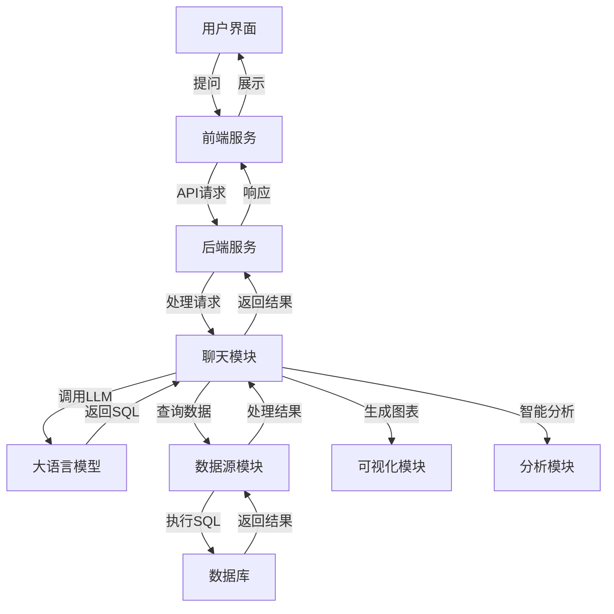

# SQLBot 项目 Code Wiki

## 1. 仓库概览

SQLBot 是一款基于大语言模型和 RAG 的智能问数系统，由 DataEase 开源项目组出品。借助 SQLBot，用户可以实现对话式数据分析（ChatBI），快速提炼获取所需的数据信息及可视化图表，并且支持进一步开展智能分析。

- **核心功能**：
  - 对话式数据分析（ChatBI）
  - 智能 SQL 生成与执行
  - 数据可视化与图表展示
  - 智能数据分析与预测
  - 多数据源管理与集成

- **典型应用场景**：
  - 业务人员快速获取数据洞察
  - 数据分析师加速数据分析过程
  - 企业内部数据查询与报表生成
  - 集成到其他应用中提供智能问数能力

## 2. 目录结构

SQLBot 采用前后端分离架构，后端基于 FastAPI 构建，前端基于 Vue.js 开发。项目结构清晰，模块化设计便于维护和扩展。

```text
├── backend/             # 后端代码目录
│   ├── alembic/         # 数据库迁移工具
│   ├── apps/            # 应用核心模块
│   │   ├── ai_model/    # 大语言模型集成
│   │   ├── chat/        # 聊天对话功能
│   │   ├── datasource/  # 数据源管理
│   │   ├── system/      # 系统管理
│   │   └── api.py       # API路由定义
│   ├── common/          # 通用功能模块
│   ├── scripts/         # 脚本文件
│   └── main.py          # 后端入口
├── frontend/            # 前端代码目录
│   ├── public/          # 静态资源
│   └── src/             # 前端源代码
├── data/                # 数据存储目录
├── docs/                # 文档目录
└── DataAgent-main/      # 数据代理相关代码
```

### 核心模块职责表

| 模块 | 主要职责 | 文件位置 | 功能说明 |
|------|---------|----------|----------|
| 数据源管理 | 管理各类数据源连接、配置和测试 | [backend/apps/datasource/](file:///Users/qiweideng/Desktop/MultiDataAgent/DataAnalyse_SQLBot-main/backend/apps/datasource/) | 支持多种数据库类型，提供连接测试、表结构管理等功能 |
| 聊天对话 | 处理用户提问、生成SQL、执行查询 | [backend/apps/chat/](file:///Users/qiweideng/Desktop/MultiDataAgent/DataAnalyse_SQLBot-main/backend/apps/chat/) | 实现Text-to-SQL转换、结果展示、图表生成等功能 |
| 大语言模型 | 集成和管理各类LLM模型 | [backend/apps/ai_model/](file:///Users/qiweideng/Desktop/MultiDataAgent/DataAnalyse_SQLBot-main/backend/apps/ai_model/) | 提供模型调用、提示词管理等功能 |
| 系统管理 | 用户、工作空间、权限管理 | [backend/apps/system/](file:///Users/qiweideng/Desktop/MultiDataAgent/DataAnalyse_SQLBot-main/backend/apps/system/) | 实现用户认证、权限控制、系统配置等功能 |
| 数据代理 | 高级数据分析功能 | [DataAgent-main/](file:///Users/qiweideng/Desktop/MultiDataAgent/DataAnalyse_SQLBot-main/DataAgent-main/) | 提供更复杂的数据分析和处理能力 |

## 3. 系统架构与主流程

SQLBot 采用分层架构设计，实现了从用户界面到数据存储的完整流程。系统通过大语言模型实现自然语言到SQL的转换，并结合RAG技术提高转换质量和准确性。

### 系统架构图



### 主流程说明

1. **用户提问**：用户在前端界面输入自然语言问题
2. **请求处理**：前端将请求发送到后端API
3. **SQL生成**：后端调用大语言模型，结合RAG技术生成SQL查询
4. **数据查询**：执行生成的SQL，从数据源获取数据
5. **结果处理**：处理查询结果，生成可视化图表
6. **智能分析**：对结果进行进一步的智能分析和解释
7. **结果展示**：将结果和图表返回给前端展示

## 4. 核心功能模块

### 4.1 数据源管理

数据源管理模块负责连接、配置和管理各种类型的数据库，是SQLBot的基础功能。

**主要功能**：
- 支持多种数据库类型（MySQL、PostgreSQL、Oracle等）
- 数据源连接测试与验证
- 表结构自动识别与管理
- 字段注释与元数据管理
- Excel文件导入功能

**核心API**：
- `datasource_list`：获取数据源列表
- `add`：添加新数据源
- `check`：测试数据源连接
- `get_tables`：获取数据源表结构
- `upload_excel`：上传Excel文件作为数据源

### 4.2 聊天对话系统

聊天对话系统是SQLBot的核心功能，负责处理用户的自然语言问题，生成SQL查询，执行查询并展示结果。

**主要功能**：
- 自然语言到SQL的转换
- 对话历史管理
- 实时流式响应
- 智能推荐问题
- 数据分析与预测

**核心API**：
- `question_answer`：处理用户提问
- `start_chat`：开始新的对话
- `recommend_questions`：获取推荐问题
- `analysis_or_predict`：执行数据分析或预测

### 4.3 大语言模型集成

大语言模型集成模块负责与各种LLM模型的交互，是SQLBot智能能力的核心。

**主要功能**：
- 支持多种LLM模型（OpenAI等）
- 提示词管理与优化
- 模型参数配置
- 会话管理与上下文保持

**核心组件**：
- `LLMService`：处理与大语言模型的交互
- `model_factory`：模型实例化与管理

### 4.4 系统管理

系统管理模块负责用户、工作空间、权限等系统级功能的管理。

**主要功能**：
- 用户认证与授权
- 工作空间管理
- 权限控制
- 系统配置
- API密钥管理

**核心API**：
- `login`：用户登录
- `user`：用户管理
- `workspace`：工作空间管理
- `aimodel`：模型配置管理

## 5. 核心 API/类/函数

### 5.1 数据源管理核心API

| API | 功能描述 | 参数 | 返回值 | 所属文件 |
|-----|---------|------|--------|----------|
| `datasource_list` | 获取数据源列表 | session, user | List[CoreDatasource] | [datasource.py](file:///Users/qiweideng/Desktop/MultiDataAgent/DataAnalyse_SQLBot-main/backend/apps/datasource/api/datasource.py) |
| `add` | 添加新数据源 | session, trans, user, ds | CoreDatasource | [datasource.py](file:///Users/qiweideng/Desktop/MultiDataAgent/DataAnalyse_SQLBot-main/backend/apps/datasource/api/datasource.py) |
| `check` | 测试数据源连接 | session, trans, ds | bool | [datasource.py](file:///Users/qiweideng/Desktop/MultiDataAgent/DataAnalyse_SQLBot-main/backend/apps/datasource/api/datasource.py) |
| `get_tables` | 获取数据源表结构 | session, id | List[TableSchemaResponse] | [datasource.py](file:///Users/qiweideng/Desktop/MultiDataAgent/DataAnalyse_SQLBot-main/backend/apps/datasource/api/datasource.py) |
| `upload_excel` | 上传Excel文件 | session, file | dict | [datasource.py](file:///Users/qiweideng/Desktop/MultiDataAgent/DataAnalyse_SQLBot-main/backend/apps/datasource/api/datasource.py) |

### 5.2 聊天对话核心API

| API | 功能描述 | 参数 | 返回值 | 所属文件 |
|-----|---------|------|--------|----------|
| `question_answer` | 处理用户提问 | session, user, request_question, assistant | StreamingResponse | [chat.py](file:///Users/qiweideng/Desktop/MultiDataAgent/DataAnalyse_SQLBot-main/backend/apps/chat/api/chat.py) |
| `start_chat` | 开始新对话 | session, user, create_chat_obj | ChatInfo | [chat.py](file:///Users/qiweideng/Desktop/MultiDataAgent/DataAnalyse_SQLBot-main/backend/apps/chat/api/chat.py) |
| `recommend_questions` | 获取推荐问题 | session, user, datasource_id | List[str] | [chat.py](file:///Users/qiweideng/Desktop/MultiDataAgent/DataAnalyse_SQLBot-main/backend/apps/chat/api/chat.py) |
| `analysis_or_predict` | 执行数据分析或预测 | session, user, chat_record_id, action_type, assistant | StreamingResponse | [chat.py](file:///Users/qiweideng/Desktop/MultiDataAgent/DataAnalyse_SQLBot-main/backend/apps/chat/api/chat.py) |

### 5.3 核心类与函数

| 类/函数 | 功能描述 | 参数 | 返回值 | 所属文件 |
|---------|---------|------|--------|----------|
| `LLMService` | 处理与大语言模型的交互 | session, user, request_question, assistant | 实例 | [llm.py](file:///Users/qiweideng/Desktop/MultiDataAgent/DataAnalyse_SQLBot-main/backend/apps/chat/task/llm.py) |
| `run_task_async` | 异步执行LLM任务 | in_chat, stream, finish_step | 无 | [llm.py](file:///Users/qiweideng/Desktop/MultiDataAgent/DataAnalyse_SQLBot-main/backend/apps/chat/task/llm.py) |
| `check_status` | 检查数据源连接状态 | session, trans, ds, test | bool | [datasource.py](file:///Users/qiweideng/Desktop/MultiDataAgent/DataAnalyse_SQLBot-main/backend/apps/datasource/crud/datasource.py) |
| `getTables` | 获取数据源表结构 | session, id | List[TableSchemaResponse] | [datasource.py](file:///Users/qiweideng/Desktop/MultiDataAgent/DataAnalyse_SQLBot-main/backend/apps/datasource/crud/datasource.py) |
| `create_chat` | 创建新对话 | session, user, create_chat_obj, datasource, assistant | ChatInfo | [chat.py](file:///Users/qiweideng/Desktop/MultiDataAgent/DataAnalyse_SQLBot-main/backend/apps/chat/curd/chat.py) |

## 6. 技术栈与依赖

| 类别 | 技术/库 | 版本/说明 | 用途 | 来源 |
|------|---------|-----------|------|------|
| 后端框架 | FastAPI | - | 构建RESTful API | [main.py](file:///Users/qiweideng/Desktop/MultiDataAgent/DataAnalyse_SQLBot-main/backend/main.py) |
| 前端框架 | Vue.js | - | 构建用户界面 | [frontend/](file:///Users/qiweideng/Desktop/MultiDataAgent/DataAnalyse_SQLBot-main/frontend/) |
| 数据库 | PostgreSQL | - | 存储系统数据 | [config.py](file:///Users/qiweideng/Desktop/MultiDataAgent/DataAnalyse_SQLBot-main/backend/common/core/config.py) |
| ORM | SQLAlchemy | - | 数据库操作 | [db.py](file:///Users/qiweideng/Desktop/MultiDataAgent/DataAnalyse_SQLBot-main/backend/common/core/db.py) |
| 数据分析 | Pandas | - | 数据处理与分析 | [chat.py](file:///Users/qiweideng/Desktop/MultiDataAgent/DataAnalyse_SQLBot-main/backend/apps/chat/api/chat.py) |
| 大语言模型 | OpenAI API | - | 自然语言处理 | [llm.py](file:///Users/qiweideng/Desktop/MultiDataAgent/DataAnalyse_SQLBot-main/backend/apps/ai_model/openai/llm.py) |
| 容器化 | Docker | - | 部署与运行 | [Dockerfile](file:///Users/qiweideng/Desktop/MultiDataAgent/DataAnalyse_SQLBot-main/Dockerfile) |
| 缓存 | Redis/Memory | - | 缓存管理 | [config.py](file:///Users/qiweideng/Desktop/MultiDataAgent/DataAnalyse_SQLBot-main/backend/common/core/config.py) |

## 7. 关键模块与典型用例

### 7.1 数据源配置与管理

**功能说明**：配置和管理各种类型的数据源，是使用SQLBot的第一步。

**配置与依赖**：
- 需要数据库连接信息（主机、端口、用户名、密码等）
- 支持多种数据库类型：MySQL、PostgreSQL、Oracle、SQL Server等

**使用示例**：

1. **添加数据源**：
   - 进入数据源管理页面
   - 点击"添加数据源"
   - 选择数据库类型，填写连接信息
   - 点击"测试连接"验证连接是否成功
   - 保存数据源配置

2. **管理数据源表结构**：
   - 选择已配置的数据源
   - 点击"同步表结构"
   - 选择需要使用的表
   - 可以编辑表和字段的注释，提高SQL生成的准确性

### 7.2 智能问数

**功能说明**：通过自然语言提问，让SQLBot自动生成SQL并执行查询，返回结果和可视化图表。

**配置与依赖**：
- 已配置的数据源
- 大语言模型API密钥（如OpenAI API Key）

**使用示例**：

1. **开始新对话**：
   - 选择一个数据源
   - 点击"开始对话"
   - 在输入框中输入自然语言问题，如"显示过去30天的销售数据"
   - 点击"发送"按钮

2. **查看结果**：
   - SQLBot会自动生成SQL并执行
   - 结果会以表格形式展示
   - 同时会生成相应的可视化图表
   - 可以点击"查看SQL"查看生成的SQL语句

3. **智能分析**：
   - 在结果页面，点击"分析"按钮
   - SQLBot会对结果进行智能分析，提供洞察和建议
   - 可以进一步提问，进行更深入的分析

### 7.3 数据导出与分享

**功能说明**：将查询结果导出为Excel文件，或分享给其他用户。

**使用示例**：

1. **导出Excel**：
   - 在查询结果页面，点击"导出Excel"按钮
   - 系统会生成Excel文件并下载

2. **分享结果**：
   - 在查询结果页面，点击"分享"按钮
   - 生成分享链接
   - 其他用户可以通过链接查看结果

## 8. 配置、部署与开发

### 8.1 部署方式

SQLBot 提供多种部署方式，最简单的是使用Docker容器部署：

```bash
docker run -d \
  --name sqlbot \
  --restart unless-stopped \
  -p 8000:8000 \
  -p 8001:8001 \
  -v ./data/sqlbot/excel:/opt/sqlbot/data/excel \
  -v ./data/sqlbot/file:/opt/sqlbot/data/file \
  -v ./data/sqlbot/images:/opt/sqlbot/images \
  -v ./data/sqlbot/logs:/opt/sqlbot/app/logs \
  -v ./data/postgresql:/var/lib/postgresql/data \
  --privileged=true \
  dataease/sqlbot
```

### 8.2 环境配置

SQLBot 的主要配置文件为 `.env` 文件，位于项目根目录。主要配置项包括：

- 数据库连接信息
- 大语言模型API密钥
- 系统参数配置
- 路径配置

### 8.3 开发环境搭建

1. **后端开发环境**：
   - 安装Python 3.8+
   - 安装依赖：`pip install -r requirements.txt`
   - 启动开发服务器：`python main.py`

2. **前端开发环境**：
   - 安装Node.js 14+
   - 安装依赖：`npm install`
   - 启动开发服务器：`npm run dev`

### 8.4 数据库迁移

SQLBot 使用 Alembic 进行数据库迁移：

```bash
# 自动生成迁移文件
python -m alembic revision --autogenerate -m "description"

# 执行迁移
python -m alembic upgrade head
```

## 9. 监控与维护

### 9.1 日志系统

SQLBot 使用 Python 标准日志库，日志配置在 `config.py` 中定义。日志文件默认存储在 `logs` 目录中。

### 9.2 常见问题与解决方案

| 问题 | 可能原因 | 解决方案 |
|------|---------|----------|
| 数据源连接失败 | 连接信息错误 | 检查数据库连接信息，确保网络可达 |
| SQL生成错误 | 自然语言表达不清晰 | 尝试更明确地表达问题，或提供更多上下文 |
| 模型调用失败 | API密钥无效或配额不足 | 检查API密钥配置，确保有足够的配额 |
| 系统性能问题 | 数据量过大或查询复杂 | 优化查询，考虑使用数据缓存 |

### 9.3 性能优化

- **使用缓存**：启用Redis缓存，提高系统响应速度
- **优化SQL**：对复杂查询进行优化，避免全表扫描
- **模型调优**：根据实际使用情况调整大语言模型参数
- **并发控制**：合理设置数据库连接池大小

## 10. 总结与亮点回顾

SQLBot 是一款功能强大的智能问数系统，通过结合大语言模型和RAG技术，实现了高质量的Text-to-SQL转换，为用户提供了便捷的对话式数据分析能力。

### 核心优势

- **开箱即用**：仅需简单配置大模型与数据源，无需复杂开发
- **安全可控**：提供工作空间级资源隔离机制，保障数据访问安全
- **易于集成**：支持多种集成方式，可快速嵌入到其他应用
- **越问越准**：支持自定义提示词、术语库配置，持续优化问数效果

### 技术亮点

- **先进的RAG技术**：通过检索增强生成，提高SQL生成的准确性
- **多模型支持**：灵活支持多种大语言模型，适应不同场景需求
- **流式响应**：提供实时的对话体验，减少用户等待时间
- **智能分析**：不仅提供数据查询，还能进行深度分析和预测
- **可扩展性**：模块化设计，易于扩展新功能和集成新数据源

SQLBot 为企业和个人用户提供了一种全新的数据访问方式，通过自然语言交互降低了数据分析的门槛，使更多人能够从数据中获取价值。随着大语言模型技术的不断发展，SQLBot 也将持续进化，为用户提供更智能、更高效的数据分析体验。